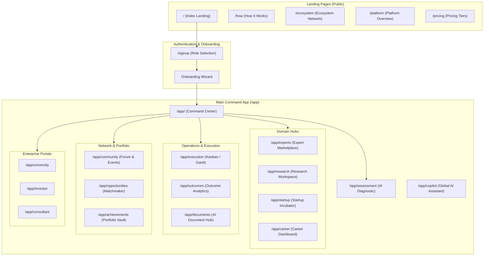

# Professional Home — The Professional Growth Ecosystem

## Master Project Specification & Roadmap (PTCF Format)

This document is the single source of truth for the **Professional Home** ecosystem platform. It serves to align developers and AI agents on the system architecture, feature requirements, design languages, animation standards, and engineering constraints.

---

## P — PURPOSE

**Professional Home** is a world-class, AI-powered Professional Growth Ecosystem Platform designed to transform how students, researchers, founders, universities, investors, and industry experts connect, collaborate, and achieve measurable outcomes.

It operates not as a static directory or simple mentorship database, but as a dynamic **operating system for professional ambition**. It bridges traditional consulting gaps with an execution-driven model:

$$\text{Traditional Consulting Model: Book Call} \longrightarrow \text{Get Advice} \longrightarrow \text{Leave}$$
$$\text{Professional Home Model: Assessment} \longrightarrow \text{Diagnosis} \longrightarrow \text{Execution Roadmap} \longrightarrow \text{Outcomes}$$

### Core Aesthetic Influences

- **Linear**: Clean execution layouts, command-driven workflows, visual task boards, and minimal clutter.
- **Notion**: Multi-layered knowledge architecture and custom documents.
- **Stripe**: Professional grade financial, data trust, and transactional interfaces.
- **Apple**: Clean typography, pixel-perfect spacing, and hardware-accelerated micro-animations.
- **Arc Browser & Perplexity**: Conversational AI sidebars, dynamic content generation, and context awareness.
- **Framer**: Fluid page transitions and gesture-driven animations.

---

## T — TASK

Design, implement, and maintain a complete premium frontend layout. Every route and page listed below is fully defined inside the `src/routes/` directory.

### 1. Landing Pages (Public Routing)

All public pages must contain cohesive navigation and layout structures using high-fidelity dark-mode themes.

- **Hero Section (`/`):**
  - Full-viewport dark background containing drifting ambient gradient orbs (deep violet, electric indigo, slate blue).
  - Slow, continuous animated particle meshes to represent a neural/social graph.
  - Sleek glassmorphic panels floating at slight angles in the background.
  - Light sweep overlay animation running automatically every 6 seconds.
  - Headline: _"Turn Ambition Into Achievement"_ (highly visible white typography).
  - Subheading: _"AI-powered assessments. Expert guidance. Execution systems. Measurable outcomes."_
  - CTAs: Primary (**Start Your Assessment** with electric blue shadow glows), Secondary (**Explore Experts** with glass border), Tertiary (**Watch Demo** with play icon).
  - Stat Ticker: Animate-up metrics listing user volumes, outcomes tracked, experts, and funding raised.
- **Trust Banner:**
  - Infinite looping marquee showing university, research lab, incubator, and corporate partner logos in monochromatic styling.
- **Metric Counter Grid:**
  - Auto count-up animation on scroll showing 6 key indicators (Active Users, Research Projects, Startups Launched, Funding Raised, Expert Mentors, Outcomes Achieved).
- **Interactive Timeline Section (`/how`):**
  - Step-by-step interactive indicator: `AI Assessment` $\rightarrow$ `Expert Matching` $\rightarrow$ `Discovery Session` $\rightarrow$ `Roadmap Creation` $\rightarrow$ `Execution Tracking` $\rightarrow$ `Outcome Achievement`.
  - Animated line connects active steps, which pulse and glow when scrolled into view.
- **Ecosystem Map Section (`/ecosystem`):**
  - Interactive SVG or Canvas map linking Students, Universities, Researchers, Founders, Mentors, Investors, and Corporations.
  - Hovering on any node triggers line highlighting showing relationships. Clicking pulls out detail cards.
- **Feature Grid (`/platform`):**
  - 12-card perspective grid utilizing CSS rotateX/Y tilt on hover.
  - Cards highlight their glassmorphic borders and shift background gradients depending on cursor coordinates.
  - Features: _AI Assessment, Expert Marketplace, Research Hub, Startup Ecosystem, Career Intelligence, Roadmap Builder, Execution Tracker, Outcome Analytics, AI Copilot, Document Intelligence, Knowledge Graph, Achievement Vault_.
- **Pricing Matrix (`/pricing`):**
  - Toggle for Monthly / Annual billing.
  - 5 interactive tiers: _Explorer (Free), Scholar (₹999/mo), Innovator (₹2,499/mo), Institution (Custom), Enterprise (Custom)_.
  - "Most Popular" Innovator tier displays active glowing border lights. Full comparison accordion drawer.

### 2. Authentication & Onboarding

- **Sign-Up Page (`/signup`):**
  - Centered glass card layout against a deep background.
  - Step-by-step sign-up flow requesting user role (Student, Researcher, Founder, Expert, Institution) before redirecting to credentials.
- **Onboarding Wizard:**
  - Multi-step form transitions (Slide + Fade animations).
  - Steps evaluate basic profiles, academic/industry domains, career/startup milestones, timeline projections, and resource availability.
  - Visual progress tracker.

### 3. Core Application (Post-Login `/app`)

Structured using a persistent left sidebar layout, top-bar navigation (Command+K search bar, notifications, and profile menus), and a persistent floating AI Copilot.

- **Command Center Dashboard (`/app/`):**
  - **Success Score Ring**: Animated circular progress ring charting overall status (e.g. 86% - A).
  - **Current Goal Card**: Actionable target checklist mapping current timeline progress bars.
  - **AI Insights Widget**: Card carousel displaying smart notifications, suggestions, and immediate warnings (e.g. _"Goal timeline mismatch"_).
  - **Activity Feed / Tasks**: Real-time listing of operations, document approvals, or mentor responses.
  - **Opportunity Stream**: Targeted matching algorithms feeding internships, research fellowships, or startup grants directly into dashboard view.
- **AI Assessment Engine (`/app/assessment`):**
  - Interactive diagnostic wizard mapping Situation, Skills, Experience, Goals, Risks, and Timelines.
  - Generates interactive spider/radar charts mapping strengths vs weaknesses, risk heatmaps, and success probability dials.
  - Contains PDF Export feature.
- **Expert Marketplace (`/app/experts`):**
  - Split-pane structure with filter drawers (Domain, Experience, Ratings, Availability, Hourly Rates).
  - Expert profile cards expanding on hover to showcase biographies, past client outcomes, and verification badges.
  - Click-through profiles with calendar bookings, verified recommendations, and video integration.
- **AI Copilot (`/app/copilot`):**
  - Persistent bottom-right interactive bubble triggering a sliding context-aware chat drawer.
  - Supports quick action prompts: _"Summarize my uploads"_, _"Generate milestone roadmap"_, _"Find corresponding grants"_.
  - Simulates streaming word-by-word outputs.
- **Research Hub (`/app/research`):**
  - Academic Kanban board (Ideation $\rightarrow$ Active $\rightarrow$ Writing $\rightarrow$ Review $\rightarrow$ Published).
  - Grant opportunities registry and patent trackers mapping procedural filings.
  - Team-formation boards to hire international researchers or student assistants.
- **Startup Hub (`/app/startup`):**
  - Incubation dashboards checking milestones, founder equity structures, cap tables, and funding runway meters.
  - **AI Pitch Deck Reviewer**: Document evaluation panel displaying slide-by-slide feedback.
  - Investor match matching engine sorted by domain interest, check size, and geographic target.
- **Career Hub (`/app/career`):**
  - Career pathing models highlighting skill gaps (target role requirements mapped against current assessments).
  - Kanban pipelines tracking Job/Internship applications.
  - AI Resume optimizer and scheduling interfaces for mock interviews.
- **Roadmap Engine (`/app/execution`):**
  - Drag-and-drop phase builder containing structured tasks, deliverables, and dependencies.
  - Gantt chart timelines and checklist grids.
- **Execution & Outcome Trackers (`/app/execution` & `/app/outcomes`):**
  - Interactive task checklist boards. Confetti bursts triggering on milestone completions.
  - Outcome charts (Recharts) logging career progress, startups launched, papers published, and grants secured.
  - _Verify Outcome_ workflow triggers for official badge validation.
- **Document Intelligence (`/app/documents`):**
  - File manager supporting PDF, Word, PowerPoint, and Spreadsheet uploads.
  - Semantic document parser letting users chat directly with individual documents, query insights, or extract annotations.
- **Ecosystem Graph / Network (`/app/community` & `/app/opportunities`):**
  - D3/Canvas force-directed network representation showing how the user is connected to experts, opportunities, and institutions.

---

## F — FORMAT

### Workspace Technology Stack

The project is built on **TanStack Start** with a fully configured React 19 single-page app containing server-side rendering support.

- **Core**: React 19, TypeScript, Vite.
- **Routing**: `@tanstack/react-router` and `@tanstack/react-start` App router.
- **Styling**: Tailwind CSS v4, supporting customized theme extensions directly inside standard CSS declarations.
- **Icons**: Lucide React.
- **Interactive Graphics**: Three.js / D3.js (ecosystem maps and knowledge graphs), Recharts (all data reporting).
- **Animations**: Framer Motion, GSAP, CSS Animations (`tw-animate-css`).
- **State & Form Management**: Zustand (global states), React Query / TanStack Query (server caching), React Hook Form + Zod (forms).

### Design Tokens (Defined in `src/styles.css`)

- **Background (Deep Black)**: `#0A0A0F` (`oklch(0.16 0.015 265)`)
- **Surface (Slate Panels)**: `#1A1A2E` (`oklch(0.20 0.018 265)`)
- **Electric Accent (Blue)**: `#3B82F6` (`oklch(0.78 0.18 240)`)
- **Violet Accent (Purple)**: `#7C3AED` (`oklch(0.65 0.22 295)`)
- **Glass White Overlay**: `rgba(255, 255, 255, 0.06)` (`oklch(0.97 0.01 250 / 0.06)`)
- **Typography**:
  - Display/Headings: `Geist` (Inter fallback)
  - Body: `Inter`
  - Code: `JetBrains Mono`
- **Border Radius**: 12px (standard cards), 8px (inputs), 20px (pill elements).
- **Gradients**:
  - Primary: `linear-gradient(135deg, oklch(0.78 0.18 240), oklch(0.65 0.22 295))`
  - Hero glow: Radial combinations centered on layout points of interest.

---

## C — CONSTRAINTS

1.  **Anti-Clutter Principle**: Dashboard views must prioritize negative space. Never overcrowd widgets. Let layouts breathe.
2.  **No Generic SaaS Styles**: Avoid flat blue colors, generic card layouts, or Standard Bootstrap panels. Use premium glassmorphic overlays with blurred backgrounds (`backdrop-filter: blur(20px)`).
3.  **Color Cap**: Do not exceed 3 primary accent tones per page view. Focus on Deep Black, Slate Grey, and Electric Blue/Violet gradients.
4.  **Premium Animation Standards**:
    - Page changes: Transitions must slide or fade smoothly.
    - Hover actions: Add subtle magnetic alignments or border light expansions to CTAs and feature panels.
    - Performance: Maintain 60 FPS hardware acceleration. Use CSS transitions or optimized Framer Motion handlers; minimize heavy JavaScript loops.
5.  **Trust Authority**: Every page layout must display trust elements. Utilize verified labels, partner logo strips, institutional tags, and secure network badges.
6.  **SEO & Semantic Structuring**: Include precise heading levels (`<h1>` through `<h6>`) and ensure interactive features have unique IDs and accessible labels.
